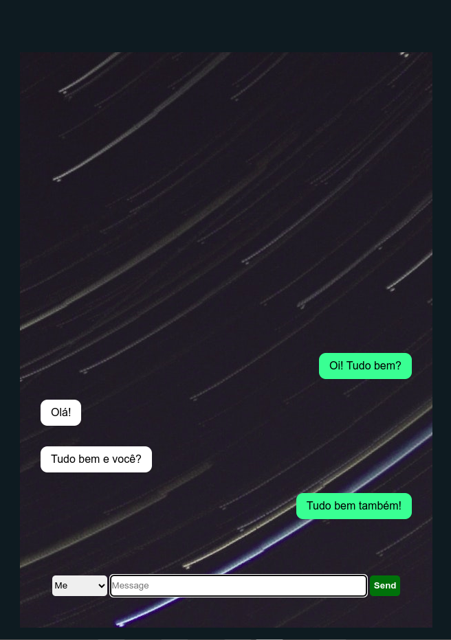

# TalkApp 📝

 **TalkApp** é um aplicativo de troca de mensagens. Nele, você pode simular uma conversa, trocando o usuário.

### Tecnologias utilizadas
- React.js
- JavaScript
- Styled-components

### Como rodar este projeto

1. Faça o clone deste repositório:
```bash
git clone https://github.com/carolcampos22/talkapp.git
```
2. Entre na pasta do projeto e rode os comandos:
```bash
cd talkapp
```
3. Instale as dependências:
```bash
npm install
```
4. Inicie o servidor:
```bash
npm run dev
```
O projeto rodará na porta localhost:5173. Clique no link que aparecerá no terminal (http://localhost:5173/).

### Layout



### Como utilizar o app
No menu suspenso a esquerda, você pode trocar o usuário (Me ou My Friend). Ao escrever a mensagem e clicar em Send ou pressionar a tecla Enter,a mensagem aparecerá na tela. 
Para deletar uma mensagem, basta dar dois cliques em cima da mensagem a ser apagada.

### Autora


#### Carolina Mendes - Web developer
[](https://www.linkedin.com/in/dev-carolina-mendes/)

